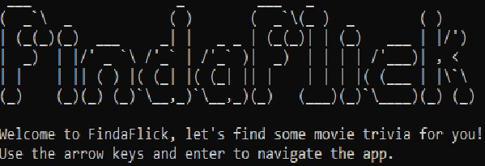
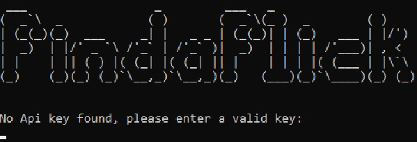

# FindaFlick
A console application used to search for information about movies.

***
An api key from <https://www.themoviedb.org/documentation/api> is required to use this application.
The user will be asked at startup for it.
***

## How it works
By using two separate api calls the application can search for movies either by an id-number or by searching for the title of a movie.
Searching for a title can result in several results while the id-search only generates one movie with that specific id-number.

## Thoughts about the application
This was an introductory project with api calls and async for me, it was really interesting and eye opening for the
possibilities of other ideas that I can pursue later on using these new skills. It was a lot of fun!